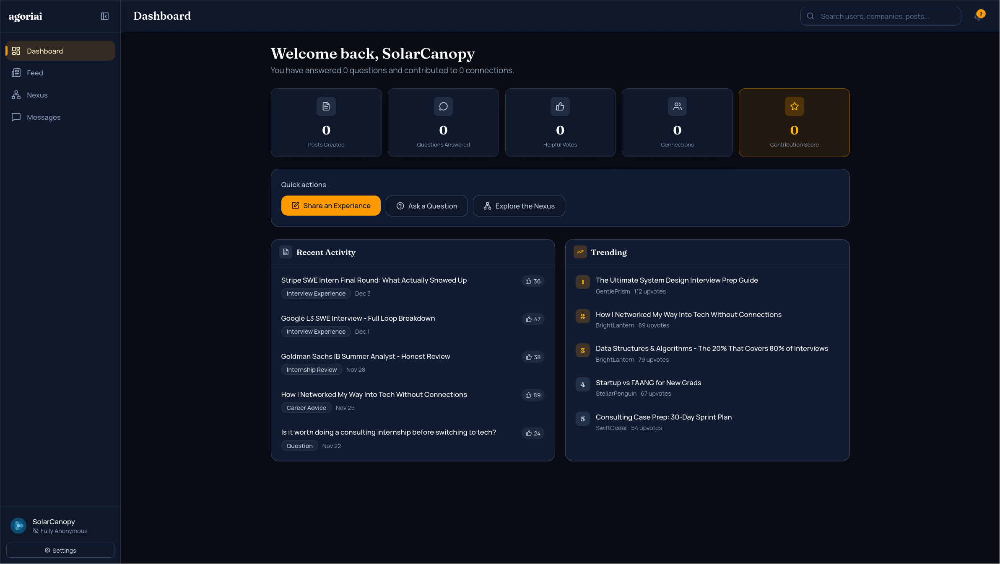
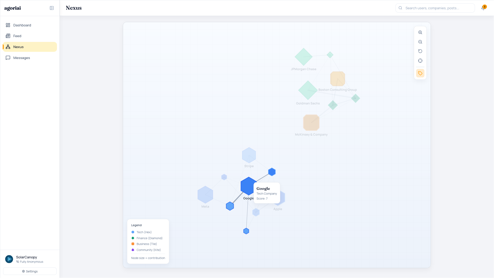
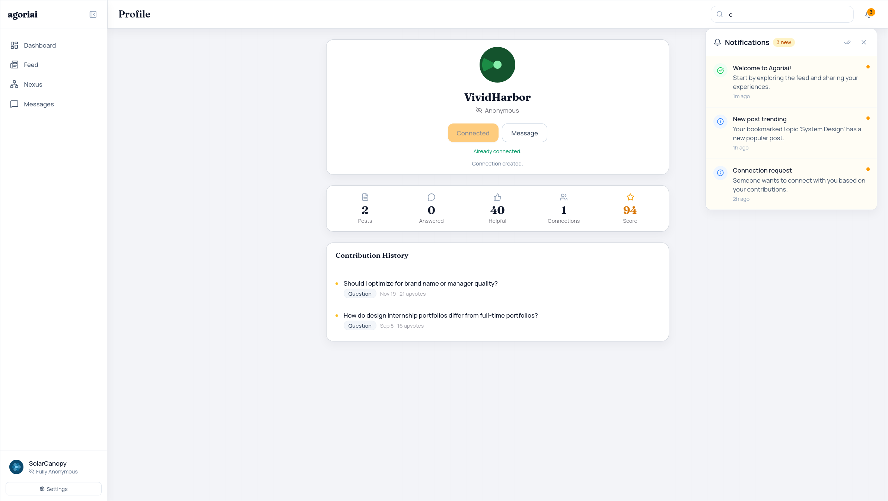
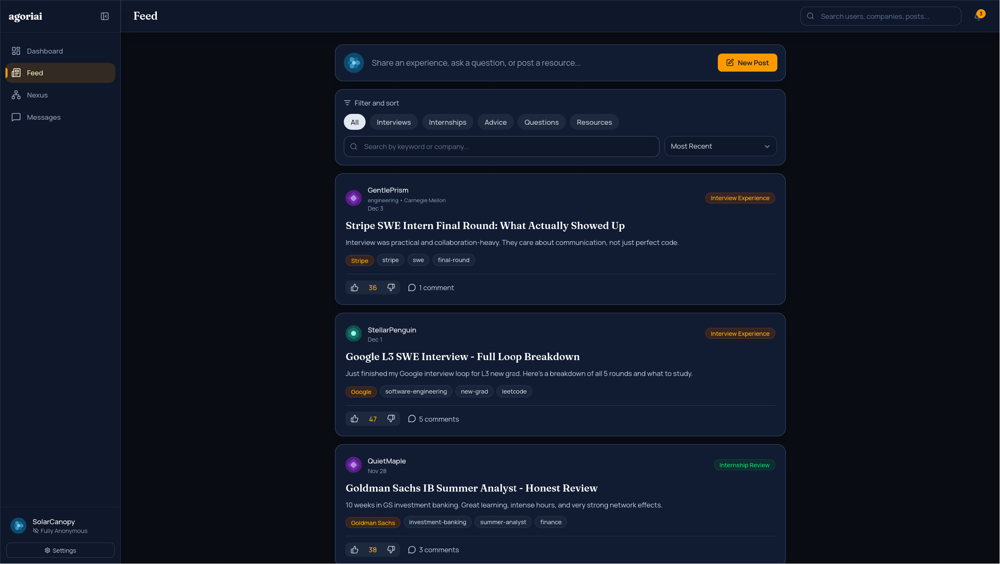

# Agoriai

Agoriai is a student-first anonymous career network where users can share experiences, ask questions, and build meaningful professional connections while controlling how much of their identity is visible.

## Screenshots

<table>
  <tr>
    <td></td>
    <td></td>
  </tr>
  <tr>
    <td></td>
    <td></td>
  </tr>
</table>

## Key Features

- Anonymous-first onboarding with generated alias and avatar identity.
- Academic email authentication with strong-password enforcement.
- Configurable identity visibility levels: `anonymous`, `role`, `school`, and `realName`.
- Community feed for interview experiences, internship reviews, career advice, resources, and questions.
- Post and comment voting with threaded replies.
- Company profiles with internship metadata and related discussions.
- Interactive `Nexus` network graph (users and companies) powered by D3.
- Direct messaging with mutual identity-reveal workflow.
- Built-in text moderation for posts, comments, tags, and messages.
- Automatic local seed data for quick development startup.

## Tech Stack

- Frontend: React 19, TypeScript, Vite, Tailwind CSS v4, TanStack Query, Zustand, Framer Motion, D3.
- Backend: Bun, Elysia, PostgreSQL, Drizzle ORM, Drizzle Kit.
- Workspace tooling: pnpm workspaces.

## Monorepo Structure

```text
.
|-- frontend/   # React web app
|-- backend/    # Elysia REST API + Drizzle schema/seed
`-- package.json
```

## Prerequisites

- Node.js (recommended: current LTS)
- pnpm (`packageManager` is pinned to `pnpm@10.28.2`)
- Bun (required by backend scripts/runtime)
- PostgreSQL

## Quick Start

1. Install dependencies:

```bash
pnpm install
```

2. Configure backend environment:

```bash
cp backend/.env_example backend/.env
```

3. Edit `backend/.env` and set at minimum:
- `DATABASE_URL` (PostgreSQL connection string)
- `CORS_ORIGINS` (for local web app: `http://localhost:5173`)

4. Apply schema:

```bash
pnpm --dir backend db:push
```

5. Start the API and frontend in separate terminals:

```bash
pnpm dev:backend
pnpm dev:frontend
```

6. Open:
- Frontend: `http://localhost:5173`
- API: `http://localhost:3001`
- API base URL used by frontend: `http://localhost:3001/api` (default)

## Environment Variables

### Backend (`backend/.env`)

| Variable | Required | Default | Notes |
| --- | --- | --- | --- |
| `DATABASE_URL` | Yes | - | PostgreSQL connection string |
| `CORS_ORIGINS` | Yes | - | Comma-separated allowed origins |
| `PORT` | No | `3001` | API server port |
| `SESSION_TTL_DAYS` | No | `30` | Auth session lifetime |
| `SEED_USER_PASSWORD` | No | `DemoPass!2026` | Password used for generated seed auth accounts |

### Frontend (`frontend/.env`, optional)

| Variable | Required | Default | Notes |
| --- | --- | --- | --- |
| `VITE_API_URL` | No | `http://localhost:3001/api` | Override API endpoint |

## Demo Login (Seeded Data)

When the database is empty, the backend seeds demo users, companies, posts, comments, graph links, and conversations automatically.

- Example email: `stellarpenguin@mit.edu`
- Default password: `DemoPass!2026` (or your configured `SEED_USER_PASSWORD` before first seed)

## Useful Commands

### Workspace (root)

- `pnpm dev:frontend` - start frontend dev server
- `pnpm dev:backend` - start backend with Bun watch mode
- `pnpm build` - build frontend
- `pnpm typecheck` - typecheck backend and build frontend

### Backend package

- `pnpm --dir backend db:generate` - generate Drizzle migrations
- `pnpm --dir backend db:push` - push schema to database
- `pnpm --dir backend db:studio` - open Drizzle Studio

## API Overview

Health and stats:
- `GET /health`
- `GET /api/stats/platform`

Auth:
- `GET /api/auth/check-email`
- `POST /api/auth/register`
- `POST /api/auth/login`
- `POST /api/auth/logout`
- `POST /api/auth/delete-account`

Users and search:
- `GET /api/users/me`
- `PATCH /api/users/me/settings`
- `GET /api/users`
- `GET /api/users/:id`
- `GET /api/users/:id/posts`
- `GET /api/search`
- `POST /api/users/:id/connect`

Companies:
- `GET /api/companies`
- `GET /api/companies/:id`
- `GET /api/companies/:id/posts`

Posts and comments:
- `GET /api/posts`
- `GET /api/posts/recent`
- `GET /api/posts/trending`
- `POST /api/posts`
- `PATCH /api/posts/:id`
- `DELETE /api/posts/:id`
- `POST /api/posts/:id/vote`
- `POST /api/posts/:id/upvote`
- `GET /api/posts/:id/comments`
- `POST /api/posts/:id/comments`
- `POST /api/comments/:id/vote`
- `PATCH /api/comments/:id`
- `DELETE /api/comments/:id`

Graph and messaging:
- `GET /api/graph`
- `POST /api/conversations/direct`
- `GET /api/conversations`
- `GET /api/conversations/:id/messages`
- `POST /api/conversations/:id/messages`
- `POST /api/conversations/:id/identity/request`
- `POST /api/conversations/:id/identity/respond`

## License

MIT (see `LICENSE`).
